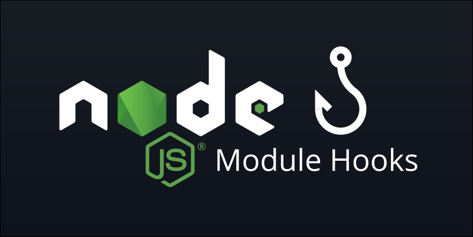

## Getting Started

**For module type imports:**
```sh
  npm install @modulehooks/module --save-dev
```

**For commonjs type imports:**
```sh
  npm install @modulehooks/commonjs --save-dev
```

## Run Code with Custom Module Hook
```sh
  node --import @modulehooks/module example.js
```

## Run Code with Loader (Legacy)
```sh
  node --loader @modulehooks/commonjs example.js
```
